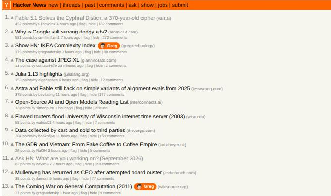

# Is It Greg?

A tiny Chrome extension that highlights Hacker News submissions linking to
[greg.technology](https://greg.technology) or any of its subdomains, as well
as stories and comments posted by Greg himself (`gregsadetsky`).

Matches get a small orange **Greg** badge (with his face on it).

## What it looks like

Stories on the front page — whether they link to greg.technology or were
submitted by Greg:

Comments by Greg:

## Install

1. Open `chrome://extensions`.
2. Turn on **Developer mode** (top right).
3. Click **Load unpacked** and select this repository's directory.
4. Browse [Hacker News](https://news.ycombinator.com). Try
   [`/from?site=greg.technology`](https://news.ycombinator.com/from?site=greg.technology)
   to see it in action.

No build step, no dependencies, no permissions beyond running on
`news.ycombinator.com`.
