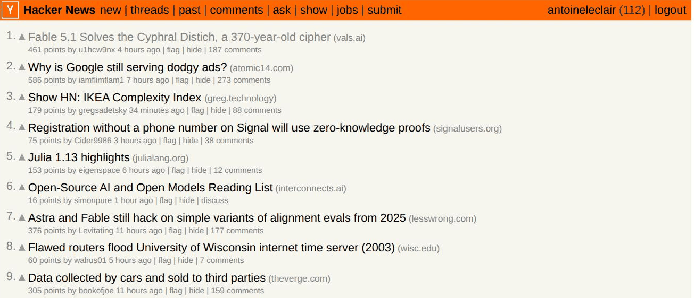
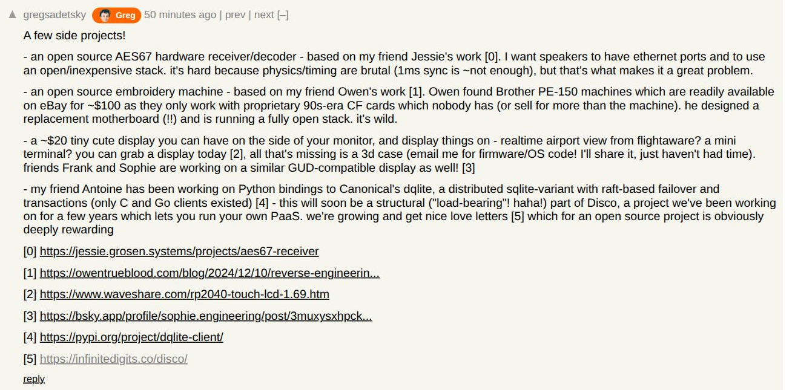

# Is It Greg?

A tiny Chrome extension that highlights Hacker News submissions linking to
[greg.technology](https://greg.technology) or any of its subdomains, as well
as stories and comments posted by Greg himself (`gregsadetsky`).

Matches get a small orange **Greg** badge (with his face on it), and Greg turns up
dancing in the corner of the page with a tally of how many of him are on it.

## What it looks like

Greg sweeps the front page, flagging stories that link to greg.technology or
that he submitted:

His comments get flagged too:

Hovering a badge explains itself, with Greg dancing alongside the reason:

And whenever there's at least one Greg on the page, he turns up dancing in the
bottom-right corner. **Click him and he throws more Gregs across the screen.**
The little orange count is its own button — click that to jump to the next
sighting on the page.

 

(With "reduce motion" turned on he holds still, and the thrown Gregs fade in
and out where they land instead of flying.)

## Install

1. Open `chrome://extensions`.
2. Turn on **Developer mode** (top right).
3. Click **Load unpacked** and select this repository's directory.
4. Browse [Hacker News](https://news.ycombinator.com). Try
   [`/from?site=greg.technology`](https://news.ycombinator.com/from?site=greg.technology)
   to see it in action.

No build step, no dependencies, no permissions beyond running on
`news.ycombinator.com`.
